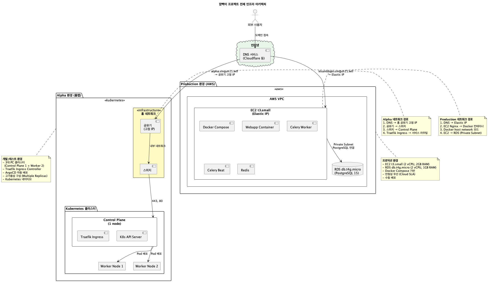
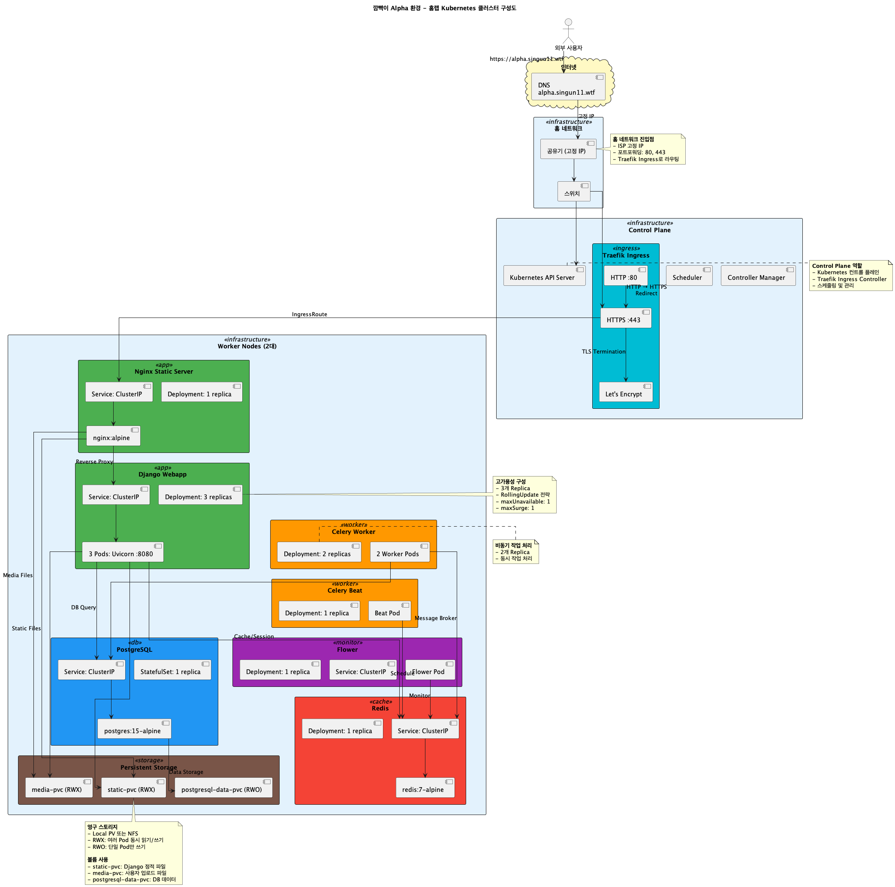
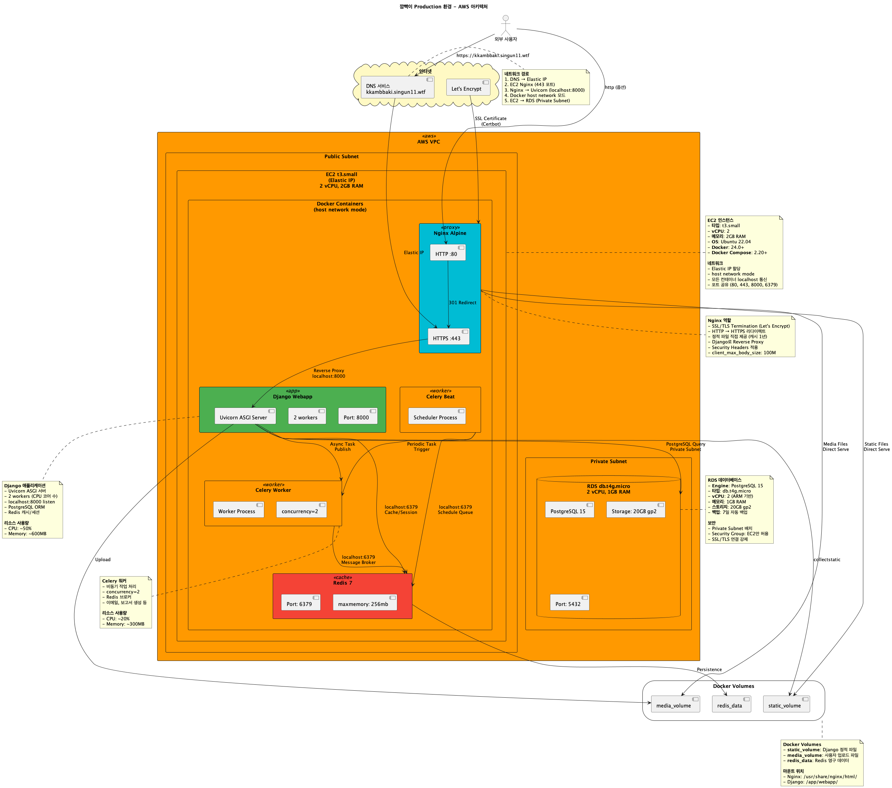

# 깜빡이 인프라 구성

> **멀티 인프라 전략**을 통한 홈랩과 클라우드 환경 구성

## 개요

깜빡이 프로젝트는 멀티 인프라 전략을 사용하여 개발/테스트 환경과 프로덕션 환경을 분리하여 운영합니다. 홈랩 Kubernetes 클러스터를 개발에 활용하고, AWS 클라우드를 프로덕션 환경으로 사용합니다.

### 환경 구성

| 환경 | 플랫폼 | 목적 | 도메인 |
| --- | --- | --- | --- |
| **Alpha** | 홈랩 Kubernetes | 개발/테스트 환경 | alpha.singun11.wtf |
| **Production** | AWS EC2 + RDS | 프로덕션 환경 | kkambbaki.singun11.wtf |

### 전체 인프라 다이어그램



---

## 목차

- [개요](#개요)
- [왜 멀티 인프라 전략인가?](#왜-멀티-인프라-전략인가)
- [기술 스택](#기술-스택)
- [Alpha 환경 (홈랩 Kubernetes)](#alpha-환경-홈랩-kubernetes)
- [Production 환경 (AWS)](#production-환경-aws)

---

## 왜 멀티 인프라 전략인가?

### 홈랩 서버의 장점

홈 서버는 다음과 같은 장점이 있습니다:

- **무료 리소스 활용**: 개인 PC 하드웨어를 활용하여 비용 절감
- **Kubernetes 네이티브 환경**: 실제 프로덕션급 컨테이너 오케스트레이션 경험
- **높은 확장성과 유연성**: 필요에 따라 리소스 자유롭게 조정 가능
- **실제 인프라 경험**: 클러스터 구성, 네트워킹, 스토리지 등 전반적인 인프라 경험

### 4호선톤 해커톤에서 홈랩을 프로덕션에서 사용하지 않은 이유

해커톤 4호선톤 해커톤 발표에서는 여러 단점이 존재했습니다:

#### 1. 물리적 접근성 문제
- 해커톤 발표 중 문제 발생 시 물리적으로 집에 있어야 대응 가능
- 현장에서 VPN 연결 등 네트워크 제약 가능성

#### 2. 하드웨어 안정성 리스크
- 발표 중 갑작스러운 부하로 인한 PC 전원 문제 가능성
- 홈 네트워크 장애 (정전, 인터넷 끊김) 시 서비스 중단
- 실시간 복구 불가능

#### 3. 실시간 모니터링 제약
- 해커톤 현장에서 물리적 서버 상태 확인 불가
- 하드웨어 레벨의 문제 해결 불가

### 결론: 하이브리드 접근

| 환경 | 인프라 | 장점 |
|------|--------|------|
| **Alpha (개발/테스트)** | 홈랩 Kubernetes | 비용 절감 + Kubernetes 네이티브 개발 경험 |
| **Production** | AWS (클라우드) | 안정성 + 확장성 |

> **참고**: 해커톤이 끝난 이후에는 **안정성과 확장성을 고려한 프로덕션 운영**이 가능하다면, 홈랩도 개발 환경뿐만 아니라, AWS와 프로덕션 환경으로 병행하여 사용할 수 있습니다.
>
> 특히 비용적인 측면에서 유리하며 홈랩을 프로덕션으로 활용할 수 있습니다.

---

## 기술 스택

### 공통 스택

| 컴포넌트 | 기술 스택 | 버전 |
|---------|----------|------|
| **Backend** | Django + Django REST Framework | 5.2 |
| **Task Queue** | Celery + Redis | - |
| **Database** | PostgreSQL | 15 |
| **Monitoring** | Flower | - |
| **Containerization** | Docker | - |

### Alpha (홈랩)

| 컴포넌트 | 기술 스택 | 
|---------|----------|
| **Container Orchestration** | Kubernetes |
| **Ingress Controller** | Traefik |
| **CI/CD** | ArgoCD + ArgoCD Image Updater |
| **Storage** | Local PersistentVolume (NFS) |
| **Registry** | GitHub Container Registry (ghcr.io) |

### Production (AWS)

| 컴포넌트 | 기술 스택 | 사양 |
|---------|----------|------|
| **Compute** | EC2 | t2.micro (프리티어) |
| **Database** | RDS PostgreSQL | t3.micro |
| **Container Runtime** | Docker Compose | - |
| **Reverse Proxy** | Nginx | - |
| **SSL** | Let's Encrypt + Certbot | - |

---

## Alpha 환경 (홈랩 Kubernetes)

### 인프라 다이어그램



### 하드웨어 구성

| 노드 타입 | 수량 | 역할 |
| --- | --- | --- |
| **Control Plane** | 1대 | Kubernetes 마스터 노드, API 서버, 스케줄러, etcd |
| **Worker Node** | 2대 | 애플리케이션 워크로드 실행 |

### 주요 특징

- **GitOps 기반 배포**: ArgoCD를 통한 자동 배포 관리
- **자동 이미지 업데이트**: ArgoCD Image Updater로 새로운 이미지 감지 및 자동 배포
- **Kubernetes 네이티브**: 실제 프로덕션 환경과 동일한 컨테이너 오케스트레이션 경험
- **Traefik Ingress**: HTTP 라우팅과 SSL 자동화
- **NFS 기반 스토리지**: PersistentVolume을 통한 데이터 영속성 보장

### 디렉토리 구조

```
alpha/
├── namespace/          # Kubernetes 네임스페이스
├── secrets/            # 시크릿 설정
├── postgresql/         # PostgreSQL StatefulSet
├── redis/              # Redis Deployment
├── webapp/             # Django 애플리케이션 워크로드
├── celery/             # Celery Worker & Beat
├── flower/             # Flower 모니터링
├── nginx/              # Nginx 정적 파일 서빙
└── ingress/            # Traefik Ingress 설정
```

## Production 환경 (AWS)

### 인프라 다이어그램



### AWS 리소스 구성

| 리소스 | 타입/사양 | 목적 |
| --- | --- | --- |
| **EC2 Instance** | t2.micro (프리티어) | 애플리케이션 워크로드 실행 (Docker Compose) |
| **RDS PostgreSQL** | t3.micro | 데이터베이스 (관리형 데이터베이스) |
| **Security Group** | VPC | 방화벽 규칙 (22, 80, 443 포트) |
| **Elastic IP** | 고정 IP | 도메인 연결 |

### Docker Compose 구성

Production 환경은 Docker Compose를 사용하여 다음 컨테이너를 관리합니다:

- **webapp**: Django 애플리케이션 워크로드 (Uvicorn ASGI 서버)
- **celery-worker**: Celery Worker (비동기 작업 처리)
- **celery-beat**: Celery Beat (주기적 작업 스케줄러)
- **redis**: Redis (캐시 및 Celery 메시지 브로커)
- **flower**: Flower (Celery 모니터링 대시보드)
- **nginx**: Nginx (리버스 프록시 및 정적 파일 서빙)

### 주요 특징

- **멀티 컨테이너 구성**: Docker 이미지 기반으로 격리된 환경 구성
- **Host 네트워크 모드**: 성능 최적화를 위한 직접 연결
- **RDS 사용**: 관리형 PostgreSQL로 안정성/백업 자동화
- **로그 로테이션**: 10MB 제한, 최대 3개 파일 유지
- **리소스 제약**: Redis maxmemory 256MB, Uvicorn 2 workers

## 비교: Alpha vs Production

| 항목 | Alpha (홈랩) | Production (AWS) |
|------|-------------|------------------|
| **컨테이너 오케스트레이션** | Kubernetes | Docker Compose |
| **데이터베이스** | PostgreSQL StatefulSet | RDS PostgreSQL (관리형) |
| **배포 방식** | GitOps (ArgoCD) | GitHub Actions (SSH) |
| **스토리지** | NFS PersistentVolume | EC2 로컬 볼륨 |
| **Ingress** | Traefik | Nginx |
| **확장성** | 높은 확장성 (노드 추가 가능) | 제한적 확장성 (수직 확장) |
| **비용** | 무료 (개인 하드웨어) | AWS 프리티어 |
| **안정성** | 물리적 하드웨어 의존 | 99.99% SLA |
| **접근성** | VPN 필요 | 인터넷 접근 가능 |

